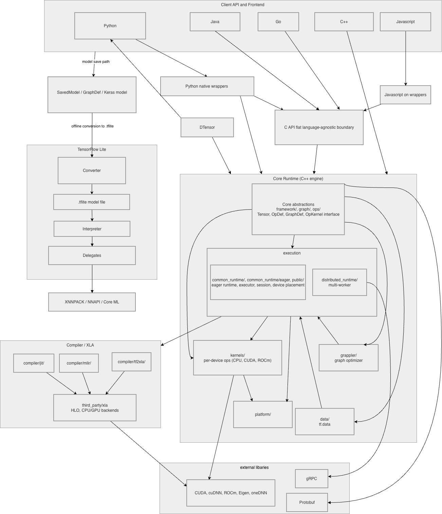
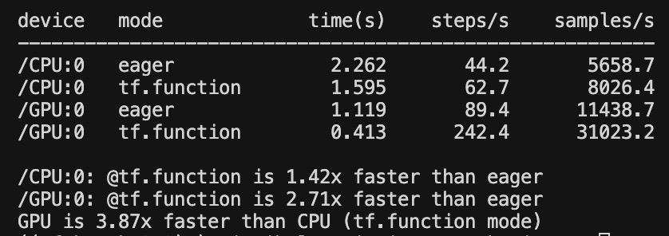

## Context and Background

TensorFlow is an open-source machine learning framework used to build, train, and deploy machine learning models. From a user perspective, TensorFlow makes it possible to build and train machine learning models without having to implement the underlying math from scratch. Once a model is trained, it can be deployed and run on almost any hardware, from a personal laptop to a large-scale data center. It is widely used in both research and production environments, making it one of the most popular machine learning frameworks available today.

TensorFlow was originally developed by the Google Brain team and first released publicly in November 2015. It is maintained by Google and a broader open-source community, with Google engineers serving as the primary approvers of architectural changes and pull requests. The project has hundreds of contributors, but Google remains the central authority on its direction.

More information about TensorFlow can be found at the following links:

- **GitHub Repository:** [https://github.com/tensorflow/tensorflow](https://github.com/tensorflow/tensorflow)
- **Official Documentation:** [https://www.tensorflow.org/api_docs](https://www.tensorflow.org/api_docs)
- **Developer Guide:** [https://www.tensorflow.org/guide](https://www.tensorflow.org/guide)

## Development View

### Overview

TensorFlow is a large and complex system, but its overall structure follows a fairly logical pattern once you understand the basic idea. The codebase is organized into layers, where the parts that users interact with sit at the top, and the low-level machinery that actually runs computations sits at the bottom. Each layer depends on the ones below it, but not the other way around. Each layer has a specific job and doesn't need to know much about what's happening above it.

### Components

**Python Frontend (`tensorflow/python/`)**
This is the part of TensorFlow that most people actually use. When someone writes `import tensorflow as tf` and starts calling functions, they are working entirely within this layer. It exposes the `tf.*` namespace and handles things like defining model structures, managing variables, and running computations. The Python frontend is itself broken up into several notable submodules, each with a distinct responsibility:

- `eager/` handles eager execution, which is the default mode where operations run immediately as they are called rather than being queued up in a graph first. 
- `autograph/` is responsible for converting regular Python control flow like `if` statements and `for` loops into TensorFlow graph operations automatically. This is what makes `@tf.function` work: user writes normal Python and AutoGraph figures out how to represent it as a graph.
- `framework/` contains the core Python-level abstractions that everything else builds on, including the tensor and graph data structures. Looking at the code, this is where foundational things like `tensor.py`, `ops.py`, and `graph.py` live.
- `ops/` contains the Python-side definitions of TensorFlow operations. These are essentially thin wrappers that let Python code trigger C++ operations underneath.
- `grappler/` is a graph optimization engine that runs before execution and rewrites computation graphs to be more efficient, for example by eliminating redundant operations or folding constants.
- `distribute/` handles distributed training at the Python level, providing the API that lets users scale training across multiple GPUs or machines.
- `saved_model/` handles saving and loading trained models in TensorFlow's SavedModel format, which is the standard way to export a model for deployment or sharing.
- `checkpoint/` handles saving and restoring model weights during and after training, which is separate from the full SavedModel export.
- `client/` contains the session client logic that manages the connection between Python and the runtime, particularly relevant in graph execution mode.
- `keras/` contains TensorFlow's bundled version of Keras, a high-level modeling API that provides ready-made building blocks like layers, optimizers, and loss functions. It is worth noting that Keras is in the process of being decoupled into its own separate repository, and recent commits in this directory (such as one titled "Remove TensorBoard dependency from TensorFlow") reflect that ongoing transition.

**C API Layer (`tensorflow/c/` and `tensorflow/cc/`)**
This component acts as a translator between the Python (or Go, or Java) frontend and the C++ core. Rather than having each language binding dig directly into C++ internals, they all communicate through this shared C interface. This is important because it means the core can change internally without breaking every language binding at once. There are two related directories here: `c/` which contains the flat C API used by most language bindings, and `cc/` which contains a higher-level C++ API built on top of it for developers writing C++ client code directly.

**Core Runtime (`tensorflow/core/`)**
This is the engine room of TensorFlow and by far the largest part of the codebase. It is written in C++ and is responsible for actually executing computations. It is divided into several important submodules:

- `framework/` defines the core abstractions of the runtime: what a tensor is, what an op looks like, how kernels are registered, and how the graph data structure is represented. Files like `tensor.h`, `op_kernel.h`, and `graph.h` live here and are included throughout the rest of the codebase.
- `kernels/` contains the actual implementations of every supported operation. Each kernel is a device-specific implementation of a mathematical operation. For example, there are separate kernel implementations of convolution for CPU and GPU. Looking at the code, even a single operation like pooling (`pooling_ops_common.cc`) has conditional compilation blocks that handle both CUDA (NVIDIA GPU) and ROCm (AMD GPU) paths.
- `common_runtime/` contains the execution engine that ties everything together. It handles scheduling ops for execution, managing devices, running the graph, and executing functions. This is where the actual "run this computation" logic lives.
- `platform/` provides abstractions over operating-system-level functionality like file I/O, threading, mutexes, and logging. This is what allows TensorFlow to run on Linux, Windows, and macOS without the rest of the codebase caring about which one it is.
- `graph/` contains utilities for building, transforming, and analyzing computation graphs, including graph algorithms and node builders.
- `protobuf/` contains protocol buffer definitions used to serialize things like graph definitions, configuration objects, and saved models for storage or transmission.

**Compiler Infrastructure (`tensorflow/compiler/`)**
This directory houses TensorFlow's compilation tooling. The most significant piece is MLIR (Multi-Level Intermediate Representation), a framework for transforming and optimizing computation graphs at various levels before they reach hardware. TensorFlow uses MLIR as a middle step between the high-level graph a user defines and the low-level code that actually runs on a device. Inside the compiler directory, there is also `jit/` which handles just-in-time compilation and the XLA bridge that connects TensorFlow graphs to the XLA compiler.

**XLA Compiler (`third_party/xla/`)**
XLA stands for Accelerated Linear Algebra, and its job is to make TensorFlow faster. Rather than executing operations one at a time, XLA can look at a group of operations, figure out a smarter way to run them together, and generate optimized machine code specifically for the hardware being used. It lives outside the main `tensorflow/` directory in `third_party/xla/`, which reflects the fact that it is treated as a somewhat independent project that TensorFlow depends on rather than owns outright. XLA has its own internal structure including separate backends for GPU (`xla/service/gpu/`) and CPU (`xla/service/cpu/`).

**TensorFlow Lite (`tensorflow/lite/`)**
TensorFlow Lite is a slimmed-down version of TensorFlow designed to run on mobile phones, microcontrollers, and other resource-constrained devices. It only supports inference (running a pre-trained model) rather than training, and uses a compact model format called `.tflite`. It is architecturally separate from the main TensorFlow runtime. Its internal structure includes:

- `core/` contains the TF Lite interpreter and the C API for inference, including the key `c_api.h` header that external applications use to load and run models.
- `kernels/` contains TF Lite's own set of operation implementations, separate from the main TensorFlow kernels, optimized for low-resource environments.
- `delegates/` is one of the more interesting parts of TF Lite's architecture. A delegate is a plugin that offloads some or all of the model's operations to a specialized hardware accelerator. This delegate system is what makes TF Lite flexible enough to take advantage of whatever hardware is available on a given device.
- `tools/` contains utilities for converting, benchmarking, and evaluating TF Lite models.

**DTensor (`tensorflow/dtensor/`)**
DTensor is TensorFlow's solution for training models across multiple GPUs or multiple machines at once. It lets developers describe how data and model parameters should be split up across a set of devices using a concept called a "mesh", and handles all the communication between those devices automatically. It is built on top of the Python frontend and the core runtime, and has both a Python API layer (`dtensor/python/`) and a C++ implementation layer underneath.

**Language Bindings (`tensorflow/java/`, `tensorflow/go/`, `tensorflow/js/`)**
There are dedicated directories for Java, Go, and JavaScript bindings. These each provide a language-native way to use TensorFlow without writing Python, and they all communicate with the core runtime through the C API layer described above.

### How the Components Fit Together

Looking at the diagram above, the overall structure of TensorFlow can be understood as a series of layers where each layer depends on the one below it but has no knowledge of anything above it. At the very top sit the user-facing components: the Python frontend and the language bindings for Java, Go, and JavaScript. These are the entry points into the system. A user writing Python interacts exclusively with the Python frontend, while a developer building an Android app might use the Java bindings instead. Neither of these components knows about the other, and they don't need to.

Both the Python frontend and the language bindings connect downward into the C API layer. This is the most architecturally significant boundary in the system. Rather than each language binding having its own direct connection to the C++ core, they all funnel through this single shared interface. The C API layer provides a stable, language-agnostic contract that the core can be built against without worrying about what language is calling it. The Python frontend requires this C interface to function, and so do all the language bindings.

Below the C API sits the Core Runtime, which is where computation actually happens. The Core Runtime receives instructions from the C API layer and is responsible for figuring out how to execute them, whether that means running operations on a CPU, dispatching to a GPU, or distributing work across machines. It provides an op execution interface that the C API layer depends on. DTensor also depends on the Core Runtime for its distributed execution capabilities, essentially acting as an extension of the Python frontend that adds multi-device awareness.

TF Lite sits somewhat outside this main stack. It receives models from the main TensorFlow system via a conversion step, but once a model is converted it runs entirely within its own lightweight runtime. Its dependency on the rest of the system is essentially one-directional and happens at build time rather than at runtime.

At the bottom of the main stack sit the compiler components: the MLIR-based compiler infrastructure and XLA. The Core Runtime depends on both of these when it needs to optimize or compile computation graphs before execution. MLIR handles graph-level transformations and passes an optimized representation down to XLA, which generates the final machine code for the target hardware.

### Internal and External Dependencies

**Internal dependencies** (between TensorFlow components):

| Component | Depends On |
|---|---|
| Python frontend | C API layer |
| Language bindings (Java, Go, JS) | C API layer |
| C API layer | Core Runtime |
| Core Runtime | Compiler infrastructure, XLA |
| DTensor | Python frontend, Core Runtime |
| TF Lite | Subset of Core ops (at conversion time only) |

**External dependencies** (components that depend on outside systems):

| Component | External Dependency | Purpose |
|---|---|---|
| Core Runtime | CUDA / cuDNN | GPU kernel execution on NVIDIA hardware |
| Core Runtime | Eigen | CPU-side linear algebra operations |
| Core Runtime | Protobuf | Serialization of graphs and SavedModel format |
| Core Runtime | gRPC | Communication between workers in distributed training |
| TF Lite | XNNPACK | Optimized CPU inference on mobile devices |
| TF Lite | NNAPI | Android neural network hardware acceleration |

### Codeline Model

The folder structure of the repository maps closely onto the component structure described above. The repository root contains a `tensorflow/` directory, under which the major components live:

| Directory | Component |
|---|---|
| `tensorflow/python/` | Python Frontend (including Keras) |
| `tensorflow/c/` and `tensorflow/cc/` | C API Layer |
| `tensorflow/core/` | Core Runtime |
| `tensorflow/compiler/` | MLIR and JIT Compiler Infrastructure |
| `tensorflow/lite/` | TensorFlow Lite |
| `tensorflow/dtensor/` | DTensor distributed training |
| `tensorflow/java/` | Java Bindings |
| `tensorflow/go/` | Go Bindings |
| `tensorflow/js/` | JavaScript Bindings |
| `third_party/xla/` | XLA Compiler |

One consistent pattern across the codebase is that test files live right next to the source files they test. For example, `immutable_dict_test.py` sits in the same folder as `immutable_dict.py`. This is a consistent pattern across both the Python and C++ parts of the codebase, and makes it straightforward to find the tests for any given piece of code.

### Testing and Configuration

TensorFlow uses a build and test system called Bazel, which was also developed by Google. The reason TensorFlow uses it is that Bazel is built for large, multi-language codebases with complex dependency graphs, which describes TensorFlow well. Every folder in the repository contains a `BUILD` file that declares what can be built from that folder and what it depends on. Running tests looks something like `bazel test //tensorflow/python/...`, which tells Bazel to find and run all test targets under the Python frontend directory.

Before building TensorFlow from source, a developer has to run a configuration script called `configure.py`. This script asks about your hardware setup and generates a configuration file that tells Bazel what to include in the build. For example, if the user has an NVIDIA GPU, the script enables CUDA support; otherwise, it won't. This means the TensorFlow binary you end up with is tailored to your specific machine rather than being a generic build.

Python dependencies are managed through a set of version-locked requirements files, one per supported Python version (for example, `requirements_lock_3_11.txt` for Python 3.11). These files pin every dependency to an exact version, which ensures that two developers building TensorFlow on different machines end up with the same set of packages.

## Applied Perspective

### 1. Perspectives

For this system, we'll be analyzing it from a Performance and Scalability perspective, as TensorFlow is a large scale software, often used for purposes such as data analysis. Overall, we want to know how well the system meets its timing and throughput requirements (performance), and how the system will perform as more users begin to rely on it (scalability).

### 2. Relevant Concerns

#### Concern 1: Throughput

Throughput can be defined as the amount of work the system can complete per unit of time under a stated workload. For TensorFlow specifically, throughput can be measured in a variety of ways due to the system's various use cases. The most common one would be samples per second, which counts how many training examples the system processes per second. For computer vision, this metric would be in images per second, and for language models tokens per second. There are many features that optimize throughput for TensorFlow, essentially allowing users to control the amount of time and resources they spend on training a model.

#### Specific features:

- **The dataflow graph + Grappler optimizer** (`tensorflow/core/grappler`): When you use `@tf.function`, TensorFlow will turn your Python function into a resuable computation graph, essentially allowing the user to run the same graph with new input values every time. TensorFlow also uses an optimzation engine called Grappler, which rewrites your graph so that certain tasks within your function can be run in parallel and plan memory ahead of time. This increases throughput by allowing for faster processing.

- **The input pipeline `tf.data`** (`tensorflow/core/data`): `tf.data` essentially optimizes GPU/CPU use for data processing. Instead of first preparing input and then training a model on that input, `tf.data` ensures that they run in parallel, allowing for input to get prepared and processed while training is occurring. TensorFlow spreads the data preparation work across different CPU threads, allowing for faster input processing, as the GPU doesn't have to idle while the CPU is normalizing the input.

- **Asynchronous, parallel kernel execution** (`tensorflow/core/common_runtime`): TensorFlow runtime essentially walks the computation graph and figures out which nodes have available inputs. The executor then uses thread pools to launch the operations on these nodes, further optimizing performance and throughput.

#### Concern 2: Scalability

Overall, TensorFlow is meant to be extremely scalable, as model code should be executable on any size of CPU, GPU, or TPU. Both vertical and horizontal scaling are used to improve scalability and ensure that the same model's operations can be implemented on different machines.

#### Specific features:

- **Vertical (scaling up)**: TensorFlow enables you to not have to rewrite model code when you move from a CPU to a large GPU because its runtime essentially abstracts hardware. On large machines, TensorFlow uses MirroredStrategy from `tensorflow/python/distribute/` in order to replicate the model on each local GPU and split input batches across them, syncing processing after each step. There are also many runtime optimizations that were already spotlighted in previous sections.

- **Horizontal (scaling out)**: `tf.distribute.Strategy` is the main API for scaling training, and the different functions assign different workers to GPUs/TPUs depending on the size of the machine that is running the model. `tensorflow/dtensor/` allows training to be split amongst multiple devices, allowing for horizontal scaling on different machines.

### 3. Activities

#### Conduct Practical Testing

The main test I did for this activity was testing out how `tf.function` optimizes model training, and how that differs on a CPU and a GPU. The results show that `tf.function` is able to make training 1.42 times faster than running model code eagerly on a CPU, and 2.71 times faster on a GPU. I tested this by creating a model that would generate a vector of ten random outputs by adding the random weights of a list of 2048 numbers (multiplied by each number) and then adjusting the weights accordingly so that the model outputs the largest number in the vector in the (randomly generated) correct index with a high level of confidence. For example, if the model outputs are <3, -2, 4, 0, 1, -5, -6, 10, -1, 2>, and the actual index is 7, the model should ideally be predicting that 7 will have the highest value with a high confidence. If not, the weights will have to be readjusted. All of this computation is what we define as a "step", and the table below shows how well the model performed on CPUs vs. GPUs, running the model code eagerly and using `tf.function`.

#### Capture the Performance Requirements

From TensorFlow's goals and our Performance and Scalability perspective, we identified six main requirements:

| Requirement | Description | Primary metric | Key mechanisms |
|---|---|---|---|
| Maximize training throughput | Process as much training data as possible per unit of time | Samples, images, or tokens per second | `@tf.function`, Grappler |
| Minimize device idle time | Keep GPUs and TPUs busy by overlapping data loading, preprocessing, and computation | GPU/TPU utilization during steady-state training | `tf.data`, async execution |
| Scale without rewriting code | Run the same model on a laptop, multi-GPU machine, or distributed cluster with minimal changes | Scaling efficiency across devices | Device abstraction, `tf.distribute`, DTensor |
| Use resources efficiently | Reduce redundant computation, unnecessary memory use, and wasted work across repeated training steps | Step time, memory use | Graph caching, XLA |
| Handle growth in load | Maintain acceptable performance as datasets, models, and worker counts increase | Throughput under increased scale | Multi-GPU and multi-worker training |

## Architectural Styles and Design Patterns

#### Architectural Style

TensorFlow's architecture is primarily **layered**. The system is divided into distinct horizontal layers where each layer only communicates with the layer directly below it, and each layer provides a well-defined interface for the layer above. The Python frontend sits at the top, the C API acts as a stable boundary layer, the Core Runtime handles execution in the middle, and the compiler and hardware abstraction layers sit at the bottom. This is a great example of layered architecture: the Python frontend has no knowledge of XLA, and XLA has no knowledge of Python.

However, TensorFlow does not conform purely to a single style. Within the layered structure, the system also exhibits a **plugin/extension style** in several places. The most visible example is TF Lite's delegate system, where hardware-specific backends (GPU, NNAPI, Hexagon DSP, Core ML) are plugged in at runtime without modifying the core interpreter. A similar pattern exists in the main runtime's kernel registration system, where new op implementations for different hardware targets can be registered without changing the framework itself. This makes TensorFlow closer to a hybrid of layered and plugin styles rather than a pure instance of either.

#### Design Patterns

**1. Facade — the `tf.*` Python API**
The entire `tensorflow/python/` layer acts as a Facade over the C++ core. The problem it solves is that the underlying runtime is written in C++ and is extremely complex. Rather than exposing any of that complexity to users, the Python frontend provides a single simplified surface: the `tf.*` namespace. A user calling `tf.matmul()` has no idea that this call is being translated through the autograph system, passed through the C API, dispatched through the op registry, and executed by a device-specific kernel. The Facade hides all of that behind a clean Python interface.

**2. Strategy — kernel dispatch in the Core Runtime**
The Core Runtime uses the Strategy pattern when deciding how to execute an operation. Every operation (like a matrix multiply or a convolution) can have multiple kernels registered for different devices: one for CPU, one for NVIDIA GPU via CUDA, one for AMD GPU via ROCm. At runtime, the executor selects the appropriate kernel based on the device the operation has been placed on. The algorithm for executing the operation varies (CPU vs GPU implementation), but the interface (the `Compute()` method on each kernel) stays the same. This is exactly the Strategy pattern: encapsulating interchangeable algorithms behind a common interface.

**3. Decorator — `@tf.function`**
The `@tf.function` decorator is a textbook use of the Decorator pattern. The problem is that Python functions run in eager mode by default, which is flexible but slower for repeated execution. By wrapping a function with `@tf.function`, the user is adding behavior on top of the original function without modifying it: the AutoGraph system traces the function, converts it into a computation graph, and caches it for future calls. The original function still exists and its logic is unchanged; the decorator simply wraps it in a new execution context. This allows the same function to be used in both eager and graph modes depending on whether the decorator is applied.

**4. Observer — Keras callbacks**
The Keras training system uses the Observer pattern through its callbacks API. During training, the model (the subject) fires events at specific points in the training loop: at the start of a batch, at the end of an epoch, when training finishes, and so on. Callback objects (the observers) register themselves with the training loop and respond to these events. A user might attach a `ModelCheckpoint` callback to save the model after each epoch, or a `TensorBoard` callback to log metrics. The training loop does not need to know anything about what specific callbacks are attached; it simply fires the events and the registered observers react. This decouples the training logic from the monitoring and logging logic.

**5. Registry — op registration in the Core Runtime**
The Core Runtime uses a Registry pattern for managing operations. Rather than hardcoding a fixed list of supported ops, TensorFlow maintains a global op registry where each operation registers itself at program startup using a macro called `REGISTER_OP`. Kernels similarly register themselves against specific op names and device types using `REGISTER_KERNEL_BUILDER`. This means new operations and new hardware backends can be added to the system simply by writing a new registration, without modifying any central dispatch table or factory class. The registry acts as a dynamic lookup mechanism that decouples op definitions from their implementations.

**6. Adapter — the C API layer**
The C API in `tensorflow/c/` acts as an Adapter between the frontend and the C++ Core Runtime. Rather than forcing every language binding to call C++ directly, TensorFlow exposes a stable C interface that translates requests from each client into the operations the core understands.

## Architectural Assessment

TensorFlow’s architecture is generally strong for a system of its size because it separates user-facing APIs from low-level execution, uses stable interfaces between layers, and supports extension through kernels, delegates, and language bindings. However, the same architectural decisions that make TensorFlow powerful also introduce complexity, especially for contributors who need to understand cross-layer behavior.

### 1. Separation of Concerns (Single Responsibility Principle)

TensorFlow demonstrates strong separation of concerns across its major components. The Python frontend is responsible for exposing a usable developer interface, while the C API and C++ runtime handle execution, memory management, device placement, and kernel dispatch. TensorFlow Lite is also separated from the main runtime because it focuses on lightweight inference for mobile and embedded environments rather than full training.

This separation is beneficial because each part of the system can evolve somewhat independently. For example, a user can write TensorFlow code in Python without needing to understand the C++ runtime, and hardware-specific kernel implementations can be updated without changing the public `tf.*` API. This supports maintainability because changes are localized to the component most responsible for that behavior.

However, the separation is not perfect. Features like `@tf.function`, AutoGraph, Grappler, XLA, and distributed execution cross several layers of the architecture. This means that debugging performance or correctness issues may require understanding how Python code is transformed into graphs and eventually executed by lower-level runtime components. Overall, TensorFlow uses separation of concerns effectively, but the system’s scale makes cross-layer interactions difficult to reason about.

### 2. Information Hiding and Stable Interfaces

TensorFlow makes heavy use of information hiding by exposing stable public interfaces while hiding implementation details underneath. The clearest example is the `tf.*` Python API. Users can call high-level functions such as `tf.matmul()` or use Keras models without needing to know which C++ kernel, device implementation, or compiler optimization is being used underneath.

The C API also acts as an important architectural boundary. It allows language bindings and external clients to interact with TensorFlow without depending directly on unstable C++ internals. This protects higher-level components from changes in the runtime implementation and makes the system easier to support across multiple languages.

This is a major architectural strength because TensorFlow is both a library and a platform. It needs to support many users, programming languages, hardware targets, and deployment environments. Stable interfaces reduce the amount of code that breaks when internal implementation details change.

The tradeoff is that stable interfaces can also slow down architectural change. Once public APIs are widely used, TensorFlow cannot easily remove or redesign them without breaking existing projects. This creates backward-compatibility pressure and can lead to older abstractions staying in the system even after newer ones are introduced.

### 3. Modifiability and Extensibility (Open/Closed Principle)

TensorFlow is designed to be highly extensible. New operations can be added through the op and kernel registration system, and TensorFlow Lite supports extension through delegates that allow parts of a model to run on specialized hardware. This plugin-like architecture supports modifiability because the system does not need one giant central dispatch table for every possible operation or device.

This is especially important for TensorFlow because machine learning hardware changes quickly. The architecture needs to support CPUs, GPUs, TPUs, mobile accelerators, and other specialized devices. By allowing different kernels and delegates to be registered separately, TensorFlow can support new hardware backends without rewriting the entire runtime.

At the same time, modifiability is limited by the complexity of the codebase. Adding a meaningful feature often requires understanding multiple directories, build rules, generated files, tests, and performance constraints. So while the architecture supports extension conceptually, the practical cost of making changes is still high. This suggests that TensorFlow is modifiable for experienced contributors, but difficult for new contributors.

### 4. Dependency Management

TensorFlow mostly follows a layered dependency structure. Higher-level APIs depend on lower-level runtime components, but lower-level components generally do not depend on the Python frontend. This is a healthy dependency direction because the most stable and reusable components sit lower in the architecture.

The use of Bazel also supports dependency management. Since each package declares its dependencies through `BUILD` files, TensorFlow can manage a large multi-language system more reliably than if dependencies were implicit. This is important because TensorFlow includes Python, C++, protocol buffers, compiler infrastructure, and platform-specific code.

However, dependency management remains a challenge because TensorFlow has many optional build paths for different environments, such as CUDA, ROCm, mobile, and distributed execution. These conditional dependencies increase build complexity and make the architecture harder to test consistently across all configurations.

### 5. Performance and Scalability

TensorFlow’s architecture is strongly shaped by performance and scalability concerns. The system is not simply designed to be easy to use; it is designed to execute large numerical computations efficiently across different hardware environments. The graph execution model, Grappler optimization, XLA compilation, `tf.data` pipelines, and distributed training APIs all exist to improve throughput, reduce wasted computation, and scale execution beyond a single device.

This is one of TensorFlow’s biggest architectural strengths. The layered design allows simple Python code to trigger highly optimized lower-level execution. A model can start as high-level user code, be transformed into a graph, optimized, compiled, and dispatched to the appropriate device-specific kernels.

The downside is architectural complexity. Performance features are spread across several components, including the Python frontend, graph optimizer, compiler infrastructure, runtime, and hardware kernels. This makes TensorFlow powerful, but also harder to understand and debug. In other words, TensorFlow prioritizes performance and scalability even when that increases internal complexity.

### 6. Dependency Inversion Principle

The **Dependency Inversion Principle** states that high-level modules should not depend on low-level implementation details, and both should depend on abstractions. TensorFlow clearly follows this principle between language frontends and the Core Runtime. The Python frontend, Java bindings, and other clients do not call unstable C++ classes directly. Instead, they depend on the stable C API in `tensorflow/c/`, which is the abstraction of the C++ classes. The C++ runtime implements that interface underneath, meaning both the runtime and client depend on the C API abstraction rather than on each other.

This is a major strength for a multi-language, multi-hardware system because it limits ripple effects when internals change. The tradeoff is that internal refactors become slow, because the system still has to be stable enough to support all the appropriate clients.

### Overall Assessment

Overall, TensorFlow’s architecture is appropriate for its goals. A smaller and simpler architecture would be easier to understand, but it would not support TensorFlow’s wide range of use cases, including research, production training, mobile inference, distributed computation, and hardware acceleration. The system’s main strengths are its layered structure, stable public interfaces, extensibility, and performance-oriented runtime. Its main weakness is complexity: many important behaviors cross multiple layers, making the system difficult for new contributors to modify confidently.
